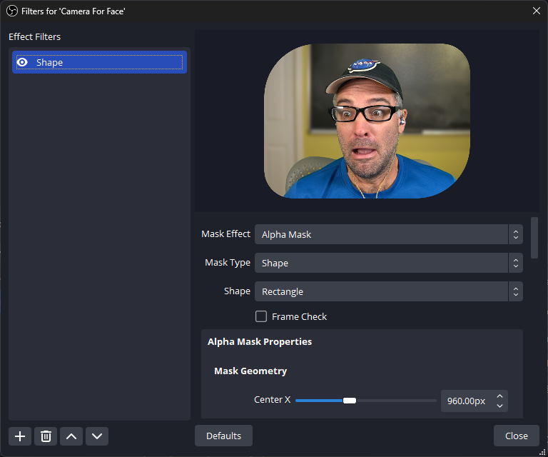
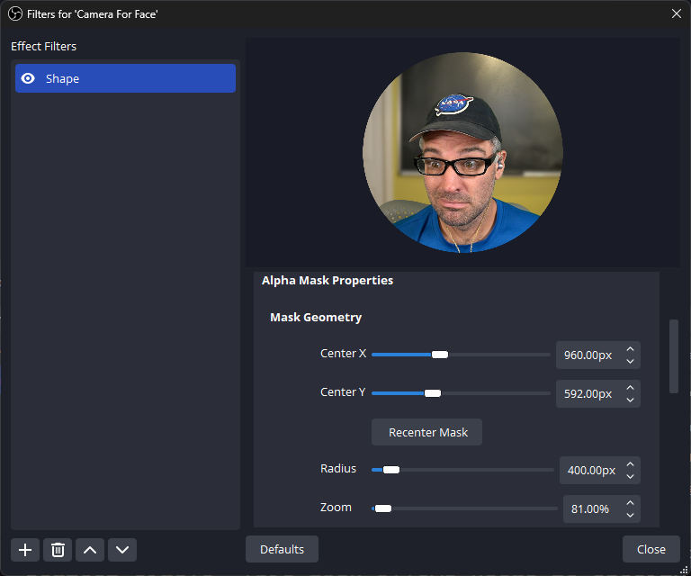
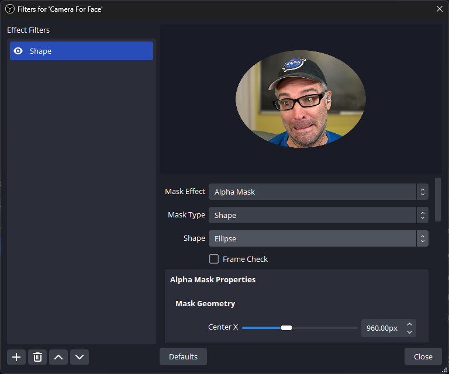
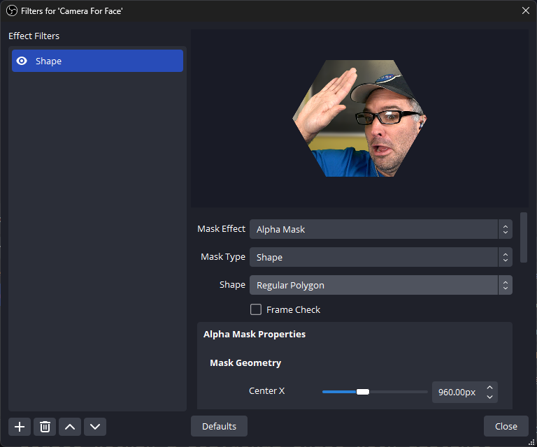
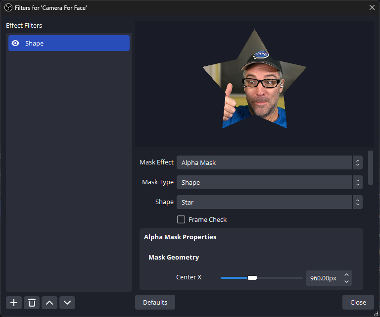
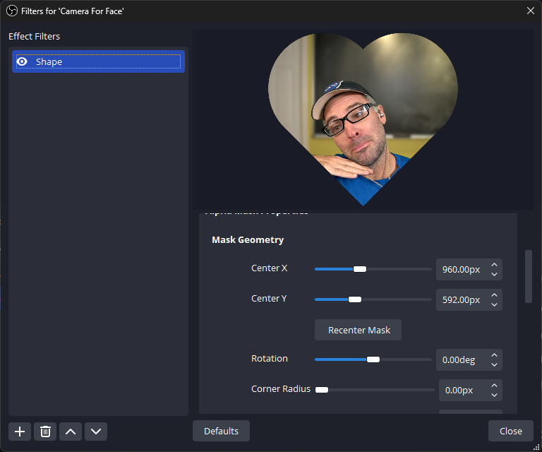
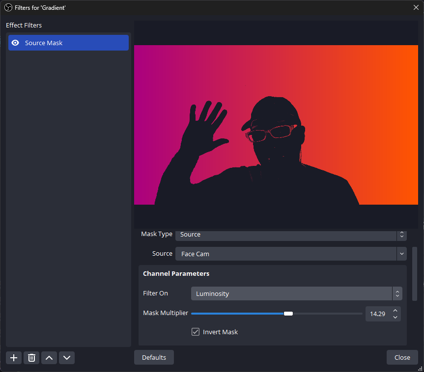
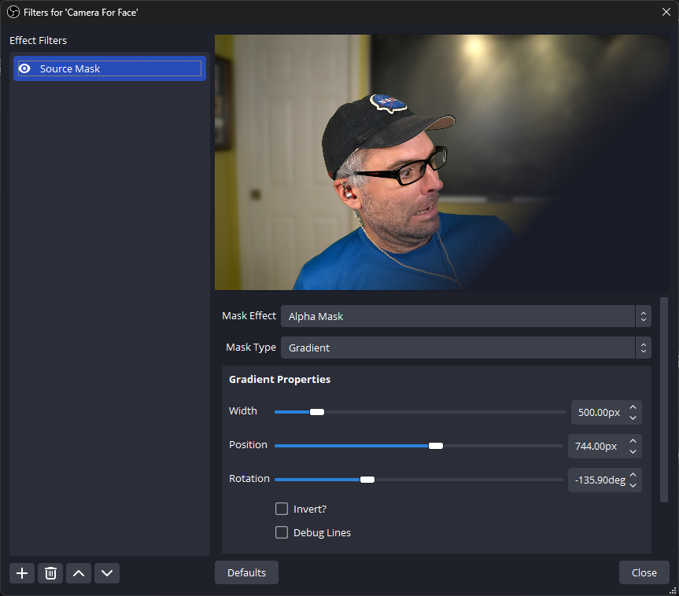

<!-- Title -->
# OBS Advanced Masks

    <i align="center">Enhance your OBS Studio masking capabilities with advanced mask options.</i>

<h4 align="center">
    
    
    
    
     
    
    
</h4>

> **Note**
> While we only release new versions of Advanced Mask after testing it on local hardware, there are bugs and issues that will slip through. If you happen to run into any issues, please [open an issue](https://github.com/finitesingularity/obs-advanced-masks/issues) and we will work to resolve it.

## Introduction

OBS Advanced Masks is an open-source project designed to expand the masking functionalities within OBS Studio. This plug-in provides filters for users to create intricate and customized masks for their OBS Scenes and Sources.

- 🎭 Advanced Masks provides both [Alpha Masking](#alpha-masking) and [Adjustment Masking](#adjustment-masking) and supports Windows, MacOS, and Linux.
- 🟠 Shape masks allow for dynamically generated [Rectangle](#rectangle), [Circle](#circle), [Elliptical](#elliptical), [Regular Polygon](#regular-polygon), [Star](#star), and [Heart](#heart) shaped masks, with many adjustable parameters.
- 🎥 [Source Masks](#source-masks) allow an existing OBS source to be used as a mask, using any combination of the red, green, blue, or alpha channels from said source.
- 🖼️ [Image Masks](#image-masks) include all of the same functionality as Source Masks, but applied via a static image (.png, .jpeg, etc).
- 🌈 [Gradient Masks](#gradient-masks) allow a fading mask using a user-specified gradient.

## Mask Types
Advanced Masks provides both [Alpha Masking](#alpha-masking) and [Adjustment Masking](#adjustment-masking) and supports Windows, MacOS, and Linux.

### Alpha Masking
An alpha mask, when applied to an OBS source, serves as a mechanism to control the transparency or opacity of specific areas within the source. It essentially defines which parts of the source are visible, partially visible, or completely transparent.

### Adjustment Masking
A color adjustment mask modifies specific colors or color ranges within an OBS source, allowing targeted changes to the hue, saturation, brightness, and contrast. It enables precise adjustments to selected areas, providing control over the visual appearance without affecting the entire source uniformly.

## Mask Algorithms
Intro to the different mask algorithms.

### Shape Masks
Shape Masks in Advanced Masks offer users a selection of [parameterized shapes](#available-shapes) that can be applied to adjust the alpha channel or color correction of sources within scenes. Users can select, customize, and apply these shapes to create targeted transparency and adjustment effects.

Shape masks also have a selectable [Scene View Transformation](#scene-view-tranformation) option which allows the user to fine tune the masked source's canvas position and scaling directly within the filter. This gives the ability to use plug-ins such as [Exeldro's Move](https://obsproject.com/forum/resources/move.913/) to animate mask changes, while retaining the proper aspect ratio.

#### Usage
##### 1. Applying the Shape Mask
- Select the source you want to apply the shape mask to.
- Go to the Filters section for that source and click the `+` icon to add a new filter.
- Choose "Advanced Masks" from the filter list.

##### 2. Configuring Shape Mask Settings
- Within the Advanced Masks settings, select shape as the Mask Type.
- Choose the desired shape from the shape dropdown menu
- Adjust the shape's parameters (e.g., size, corner radius) to customize the mask.

##### 3. Fine-tuning Mask Properties
- Experiment with different shapes and their parameters to achieve the desired transparency effect.
- Preview the scene and make necessary adjustments to attain the intended result.

#### Available Shapes
##### Rectangle

The rectangular mask is a customizable mask used to frame an OBS Source with a rectangular shape featuring rounded corners. This mask offers the flexibility to adjust the width, height, rotation, and, corner radius, allowing users to modify the curvature of each corner independently. Users can optionally set and modify the corner radius, enabling them to create rectangular shapes with varying degrees of roundedness, from sharp edges to completely rounded corners, based on their preferences or design requirements.

##### Circle

The circular mask is used to frame an OBS Source within a perfect circle. This mask allows users to specify the desired radius, enabling them to create circular masks of varying sizes, from small circles to larger ones, offering flexibility in how the content within the circle is displayed or highlighted.

##### Elliptical

The ellipse mask is used to frame an OBS Source within an ellipse, offering flexibility in its dimensions and orientation. Users can define the width and height of the ellipse independently, allowing for an elliptical shape that can be taller, wider, or more elongated based on their specifications. Additionally, users have the option to adjust the rotation of the ellipse, enabling them to orient it at various angles within the scene. This level of control allows for the creation of elliptical masks of different proportions and orientations to suit specific design or visual requirements.

##### Regular Polygon

The regular polygon mask allows users to frame an OBS source within a polygonal shape with distinct characteristics. Users can specify:

1. Number of Sides: Determines the polygon's shape, allowing for triangles, squares, pentagons, hexagons, and more, based on the chosen number of sides.
2. Polygon Radius: Defines the size or extent of the polygon, determining how large or small the shape appears within the Scene.
3. Corner Radius: Adds the option to round off the polygon's corners, softening the edges and creating a smoother appearance.
4. Rotation: Enables users to orient the polygon at different angles within the OBS scene, offering diverse orientations for creative framing.

This level of customization provides users with the ability to create regular polygonal masks of various shapes, sizes, corner styles, and orientations, allowing for versatile geometric framing tailored to specific visual preferences or design requirements.

##### Star

The star mask offers users a versatile tool for framing OBS Sources within a star-shaped pattern, with the ability to specify various parameters:

1. Number of Spikes: Allows users to define the number of points or spikes on the star, determining its overall shape, such as five-pointed, six-pointed, or multi-pointed stars.
2. Inner and Outer Radius: Enables users to set both the inner and outer radii of the star, controlling the size and spike length of the star shape.
3. Corner Radius: Provides an option to adjust the corner radius, allowing users to round off the corners of the star's spikes, creating a smoother and softer appearance. Even allowing for non-star shapes such as flowers.
4. Orientation: Allows users to rotate the star mask to different angles within the image or video frame, providing flexibility in positioning the star shape.

This comprehensive set of customizable parameters empowers users to create star-shaped masks with varying numbers of spikes, sizes, corner styles, and orientations, offering flexibility for creative framing and visual effects according to specific preferences or design requirements.

##### Heart

The heart-shaped mask grants users the ability to encase OBS sources within the iconic outline of a heart. Users can precisely define two fundamental parameters: size and orientation. The size parameter allows users to scale the heart shape, making it larger or smaller within the OBS Scene. Meanwhile, the orientation feature empowers users to rotate the heart mask, providing the flexibility to position the heart shape at diverse angles. These adjustable parameters facilitate the creation of heart-shaped masks in various sizes and orientations, presenting a recognizable and customizable visual element for framing content with the symbolic and universally understood shape of a heart. *Special thanks to GPT for this fantastically over the top description of a heart mask*

#### Scene View Tranformation
The Scene View Transformation feature allows users to adjust a masked source's position and scale within its parent scene while maintaining its original size and aspect ratio. This functionality is particularly useful for precise positioning, scaling, and animating masked sources.

> **Note**
> Simultaneously using the built in OBS source transformation along with the Scene View Transformation option may lead to unexpected behavior. It's recommended to avoid applying transformations directly on a source in an OBS scene when that source utilizes Scene View Transformation to ensure consistent and expected results in adjusting masked sources within the scene.

Additionally, this feature pairs well with the Move Value filter, enhancing the ability to animate shape masks effectively. By combining the Scene View Transformation option with the Move Value filter, users can smoothly control the movement and animation of shape masks, preserving accurate sizing and proportions within the scene.

### Source Masks
The Source Mask feature in the Advanced Masks OBS plugin empowers users to dynamically create masks from separate OBS sources. By utilizing color and alpha channels, this functionality allows for versatile and precise masking within your scenes. This guide aims to walk intermediate to advanced OBS users through the implementation, customization, and practical application of the Source Mask feature.

Source Masks in Advanced Masks facilitate the creation of complex shapes or selective overlays by using one source as a mask for another. This offers a wide array of creative possibilities, such as blending scenes, highlighting specific areas, or creating intricate visual effects.

#### Usage
##### 1. Setting Up Sources
- Add the sources you intend to use for masking.
- Ensure the sources are positioned as desired within your scene.
##### 2. Applying the Source Mask
- Select the source you wish to apply the mask to.
- Navigate to the Filters section for that source and click the + icon to add a new filter.
- Choose "Advanced Masks" from the filter list.
##### 3. Configuring Source Mask Settings
- Within the Advanced Masks settings, select "Source Mask" for the Mask Type field.
- Choose the source you want to use as the mask from the Source dropdown menu.
- Use the Channel Parameters to determine how the masking source is applied.  Options include using the Alpha mask only, the source's luminance values, the source's greyscale values, or a custom combination of color channels.

### Image Masks
Image masks are identical in functionality to [source masks](#source-masks), but use a static image file (`.png`, `.jpg`, etc.) instead of an OBS source.

### Gradient Masks
Gradient Masks in Advanced Masks offer users the ability to create smooth transitions and controlled fades within scenes. By defining gradient sizes and orientations, users can manipulate the alpha channel or color correction, allowing gradual opacity and color adjustments in their sources.

#### Usage
##### 1. Applying the Gradient Mask
- Select the source to which you want to apply the gradient mask.
- Navigate to the Filters section for that source and click the `+` icon to add a new filter.
- Choose "Advanced Mask" from the filter list.

##### 2. Configuring Gradient Mask Settings
- Within the Advanced Mask settings, select "Gradient" in the Mask Type dropdown.
- Adjust the gradient size to define the range of the mask's influence on transparency/adjustment.
- Define the orientation of the gradient to control how the transparency/adjustment changes across the source.

##### 3. Fine-tuning Mask Properties
- Experiment with gradient sizes and orientations to achieve the desired transparency effect.
- Preview the scene and make necessary adjustments to achieve your intended result.

Thank you for exploring OBS Advanced Masks! Your feedback and contributions are highly appreciated as we continue to improve and expand this project.
